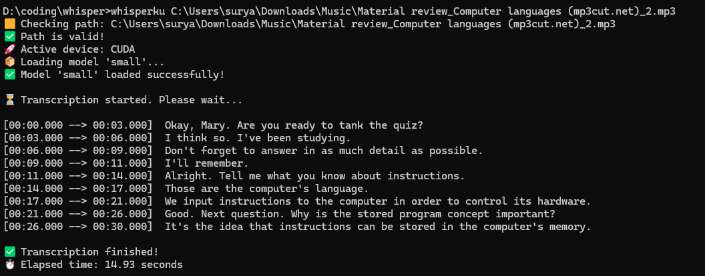

# Whisper Speech-to-Text Script

## 🇮🇩 Bahasa Indonesia

Skrip ini adalah alat baris perintah sederhana untuk mentranskripsi file audio menjadi teks menggunakan model Whisper dari OpenAI.

**Dibuat dengan ❤️ menggunakan [OpenAI Whisper](https://github.com/openai/whisper)**

---

### Contoh Output

Di bawah ini adalah screenshot hasil penggunaan skrip di Windows:



Skrip akan menampilkan info device, proses loading model, progress real-time, dan hasil transkripsi lengkap dengan timestamp.

### Fitur
- Mendukung format audio: mp3, wav, m4a, flac, ogg
- Otomatis memilih device (CUDA jika tersedia, jika tidak maka CPU)
- Indikator progress real-time saat transkripsi
- Pesan error dan tips penggunaan yang jelas

### Kebutuhan
- Python 3.8+
- [OpenAI Whisper](https://github.com/openai/whisper)
- [PyTorch](https://pytorch.org/)

> **Catatan:**
> Jika ingin menggunakan akselerasi GPU (CUDA), pastikan sudah menginstal [NVIDIA CUDA Toolkit](https://developer.nvidia.com/cuda-downloads) dan PyTorch versi CUDA yang sesuai. Lihat [PyTorch Get Started](https://pytorch.org/get-started/locally/) untuk perintah instalasi yang tepat.

### Instalasi
1. Clone repository ini:
   ```sh
   git clone https://github.com/ibrahimbtaz/whisper-locally-with-torch
   cd whisper-locally-with-torch
   ```
2. Install dependensi:
   ```sh
   pip install torch whisper
   ```
   - Jika ingin menggunakan CUDA (GPU), ikuti [panduan instalasi PyTorch](https://pytorch.org/get-started/locally/) untuk versi CUDA yang sesuai. Contoh untuk CUDA 12.1:
   ```sh
   pip install torch torchvision torchaudio --index-url https://download.pytorch.org/whl/cu121
   ```

### Penggunaan
Skrip dapat dijalankan dengan dua cara:

#### 1. Dengan argumen path file audio
```sh
python whisperku.py "path/ke/audio.mp3"
```

#### 2. Tanpa argumen (input manual)
```sh
python whisperku.py
```
Lalu masukkan path file audio saat diminta.

#### 3. Jalankan langsung dengan file .bat (Windows)
Buat file `whisperku.bat` di folder yang sama dengan isi:
```bat
@echo off
python path-to-your-whisperku.py %*
```
Lalu jalankan:
```sh
whisperku "path/ke/audio.mp3"
```

#### 4. (Opsional) Tambahkan ke PATH Windows
Agar bisa menjalankan `whisperku` dari folder mana saja, tambahkan folder script ke PATH di Environment Variables Windows.

### Output
- Hasil transkripsi akan tampil di terminal.
- Progress dan waktu proses akan ditampilkan selama transkripsi.

### Catatan
- Untuk hasil terbaik, gunakan file audio yang jernih dan tidak rusak.
- Model Whisper dapat diganti dengan mengedit variabel `model_name` di skrip.
- Jika tidak ada GPU NVIDIA/CUDA, skrip akan otomatis berjalan di CPU.
- GPU AMD **tidak didukung** untuk akselerasi.

---

# English Version

This project provides a simple command-line tool to transcribe audio files to text using OpenAI's Whisper model.

**Made with ❤️ using [OpenAI Whisper](https://github.com/openai/whisper)**

---

## Example Output

Below is a screenshot of the script in action on Windows:


The script shows device info, model loading, real-time progress, and prints the transcription result with timestamps. 

## Features
- Supports audio formats: mp3, wav, m4a, flac, ogg
- Automatic device selection (CUDA if available, otherwise CPU)
- Real-time progress indicator during transcription
- Clear error messages and usage tips

## Requirements
- Python 3.8+
- [OpenAI Whisper](https://github.com/openai/whisper)
- [PyTorch](https://pytorch.org/)

> **Note:**
> If you want to use GPU acceleration (CUDA), make sure you have installed the [NVIDIA CUDA Toolkit](https://developer.nvidia.com/cuda-downloads) and the appropriate PyTorch version with CUDA support. See [PyTorch Get Started](https://pytorch.org/get-started/locally/) for the correct installation command for your system.

## Installation
1. Clone this repository:
   ```sh
   git clone https://github.com/ibrahimbtaz/whisper-locally-with-torch
   cd whisper-locally-with-torch
   ```
2. Install dependencies:
   ```sh
   pip install torch whisper
   ```
   - If you want to use CUDA (GPU), follow the [PyTorch installation guide](https://pytorch.org/get-started/locally/) to install the correct version for your CUDA toolkit. Example for CUDA 12.1:
   ```sh
   pip install torch torchvision torchaudio --index-url https://download.pytorch.org/whl/cu121
   ```

## Usage
You can run the script in two ways:

### 1. With an audio file path as an argument
```sh
python whisperku.py "path/to/your/audio.mp3"
```

### 2. Without an argument (manual input)
```sh
python whisperku.py
```
Then enter the path to your audio file when prompted.

### 3. Run directly with a .bat file (Windows)
If you want to run `whisperku` directly like in the screenshot, you can create a `whisperku.bat` file in the same folder with the following content:

```bat
@echo off
python path-to-your-whisperku.py %*
```

Now you can use the command below in your terminal (cmd):
```sh
whisperku "path/to/your/audio.mp3"
```
Or just type `whisperku` and input the path manually when prompted.

### 4. (Optional) Add to Windows PATH
To run `whisperku` from any folder in Command Prompt, add the script folder to your Windows `PATH`:

1. Copy the folder path where `whisperku.bat` is located (e.g., `C:\Users\yourname\path-to-your-whisper-locally-with-torch`).
2. Open **Control Panel** → **System** → **Advanced system settings** → **Environment Variables**.
3. In the "System variables" section, find and select `Path`, then click **Edit**.
4. Click **New**, paste your folder path, and click **OK**.
5. Restart your Command Prompt.

Now you can run:
```sh
whisperku "path/to/your/audio.mp3"
```
from any directory!

## Output
- The script will print the transcription result to the terminal.
- Progress and elapsed time will be shown during processing.

## Notes
- For best results, use clear, undamaged audio files.
- You can change the Whisper model by editing the `model_name` variable in the script.
- If you do not have an NVIDIA GPU/CUDA, the script will automatically run on CPU.
- AMD GPUs are **not supported** for acceleration.

